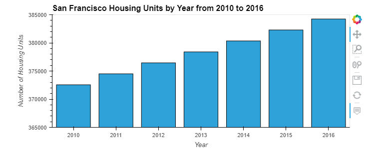
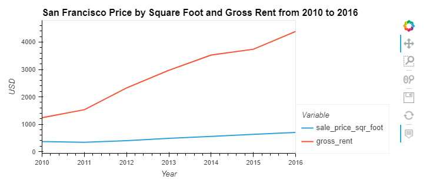
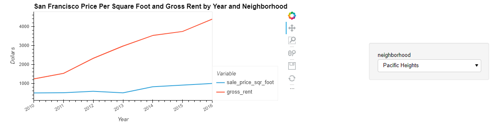
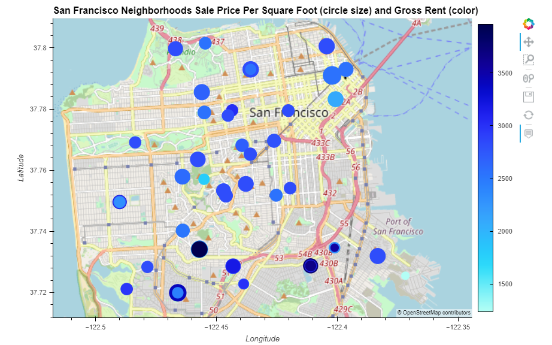

# Mod6_Challenge - Visualizing San Francisco Real Estate Data

This program uses data and visualization to examine price trend in San Francisco real estate between 2010 and 2016.
It can be used to track pricing trends (sale price per square foot, number of housing units and gross rents) during the time period.
Some graphs include interactive elements and geospatial rendering.

# Required programs and libraries
Requires python and Anaconda and the following libraries:
PyViz
hvplot
geoviews

To install from terminal:
'''
conda install -c pyviz hvplot geoviews
'''

Libraries called in program:
'''
import pandas as pd
import hvplot.pandas
from pathlib import Path
'''

# Data Sources
Data is pulled from two csv files provided in the Resources file

File 1 is named sfo_neighborhoods_census_data.csv and contains: year, neighborhood, sale_price_sqr_foot, housing_units, gross_rent

File 2 is named neighborhood_coordinates.csv and contains: neighborhood, latitude and longitude

The two files get concatenated into a new file called all_neighborhoods_df

# Sections

**Section 1:** Calculates and plots the number of housing units per year in a bar chart.

**Section 2:** Calculates and plots the average sale price per square foot as a line graph
with lines for sale price per square foot and gross rent.
    
    

**Section 3:** Compares the average price by neighborhood and creates an interactive
hvplot that can sort the data by neighborhood.
    

**Section 4:** Builds an interactive neighborhood map using geolocation

This map marks locations with a circle that is sized to show sale price per square foot - 
larger circle means higher price.

The color intensity of each circle indicates relative gross rent amount - darker color
indicates higher gross rent.
    
    

# Creator
Program by Ann Howell with guidance from Rice FinTech Bootcamp

# License
MIT